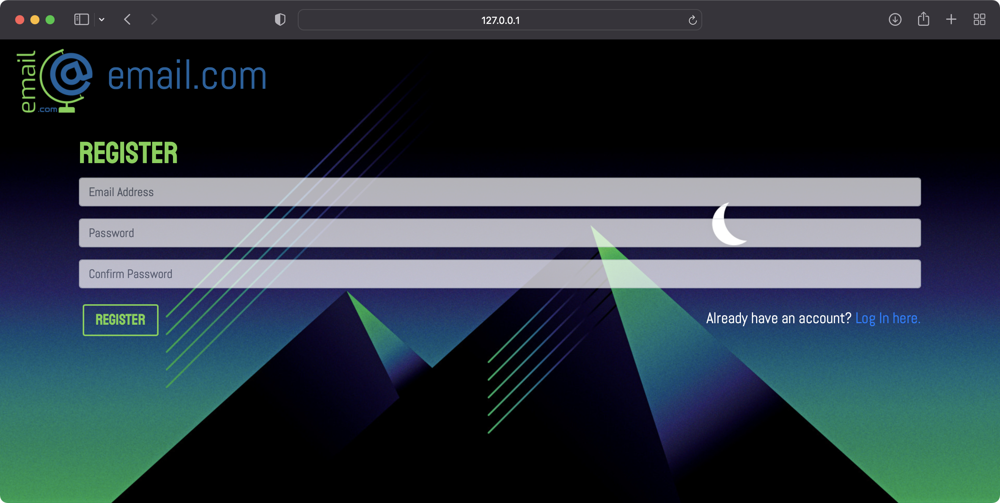
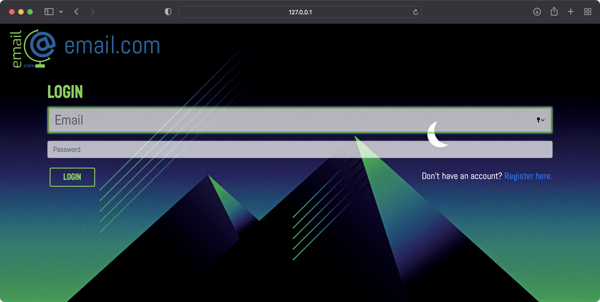
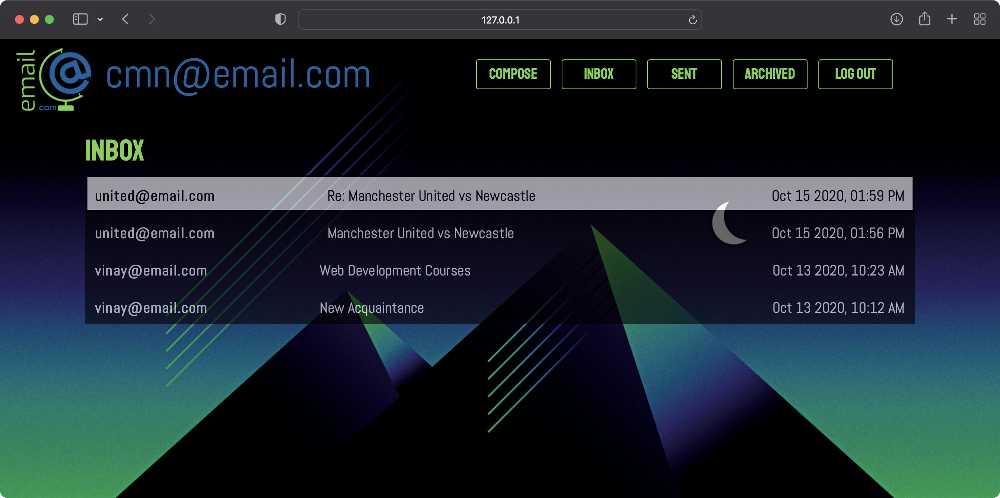
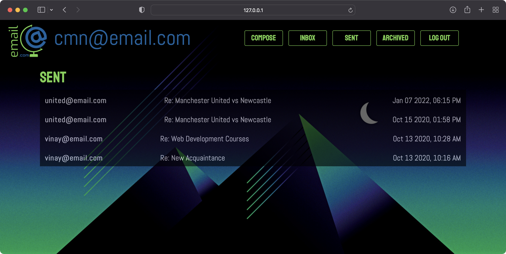
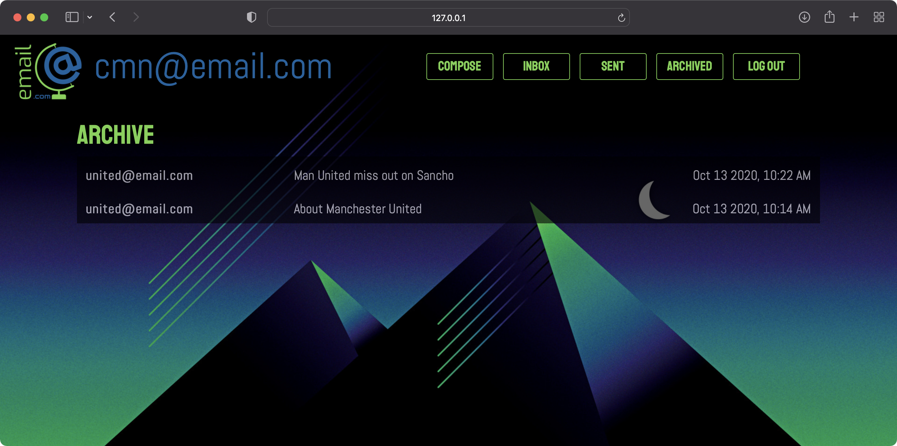
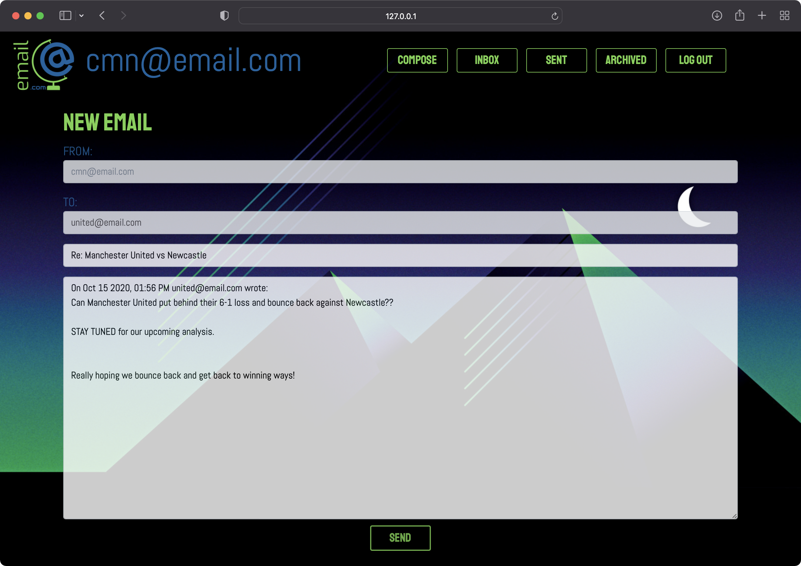

# Mailing System 

      


<br/>  
<br/>  


## Table Of Contents
- [Introduction](#introduction)
- [Setup](#setup)
- [About the Application](#about)
  - [Registration Page](#registration-page)
  - [Login Page](#login-page)
  - [Index Page](#index-page)
    - [Inbox](#inbox)
    - [Sent](#sent)
    - [Archive](#archive)
    - [Composing a New Mail](#composing)
    - [Replying to a Mail](#replying)
- [Author](#author)


<br/>  
<br/>  


<div name="introduction">

## Introduction
A single page web application that allows users to send and receive emails. 

**NOTE:** This application is not an email client. Sending and receiving of mails between users is possible within this applcaition only.


<br/>  
<br/>  


<div name="setup">

## Setup

### Cloning the Repository
You can clone this repository by either downloading a zip file or by using the following command.
```
git clone https://github.com/cmn22/mail
```

<br/>

### Creating a virtual environment 
#### For Unix/macOS
1. Installing virtualenv
    ```
    pip install virtualenv
    ```
2. Creating a virtual environment
    ```
    python venv env
    ```
3. Activating the virtual environment
    ```
    source env/bin/activate
    ```
<br>    

#### For Windows
1. Installing virtualenv
    ```
    pip install virtualenv
    ```
2. Creating a virtual environment
    ```
    python venv env
    ```
3. Activating the virtual environment
    ```
    .\env\Scripts\activate
    ```

<br/>
<br/>

### Installing required dependencies
Install the required packages as stated in requirements.txt file
```
pip install -r requirements.txt
```

<br/>
<br/>

### Running the application
1. Make Migrations 
    ```
    python manage.py makemigrations
    ```
2. Migrate
    ```
    python manage.py migrate
    ```
3. Runserver (on port 8000)
    ```
    python manage.py runserver 0.0.0.0:8000
    ```
4. Open the corresponding address on a web browser and your application should be up and running.


<br/>
<br/>


<div name="about">

## About the Application

<div name="registration-page">

### Registration Page: (/register)

The **Register Page** helps a new user to create a new email account so that the user can start sending and receiving emails. If the user already has an account, he can directly login.

  
<br/>
<br/>

<br/>


<div name="login-page">

### Login Page: (/login)
The **Login Page** helps the user to login in so that he can start sending and receiving emails. If the user does not have a account, he can create one using the register option.  


<br/>
<br/>  


<br/>  


<div name="index-page">

### Index Page: (/)
As this is a single page web application, this index route contains all the parts of the web page. This route has various view sections such as, mail list, detailed mail view and compose view all of which is controlled using JavaScript.  

The **Home Page** has the header navigation bar using which the user can access the different functionalities if the website. The user can compose a new email, access his/her Inbox, Sent box or Archive box and can also Logout.  


<br/>  

<div name="inbox">

#### INBOX
The user is by default presented with the **Inbox**, where he/she can see all the emails that they have received. Optionally, the user can access his sent emails by clicking on the SENT button in the navigation bar.  
Unread emails have a whitish background while the read messages have a greyish/blackish background.  
On accessing a email via the Inbox, the user can additionally reply or archive the email.

 
<br/>
<br/> 


<br/>  

<div name="sent">

#### SENT
The user is automatically taken to the **Sent Box**, where he/she can see all the emails that they have sent. Optionally, the user can access his sent emails by clicking on the _SENT_ button in the navigation bar.  
All sent emails have a greyish/blackish background.  
On accessing a email via the Sent box, the user cannot perform any additional functionality.

  
<br/>
<br/>


<br/>  

<div name="archive">

#### ARCHIVE
The user can access the **Archive Box**, where he/she can see all the emails that they have archived by clicking on the _ARCHIVE_ button in the navigation bar.  
All sent emails have a greyish/blackish background.  
On accessing a email via the Archive box, the user can either reply to the email or un-archive it.

  
<br/>
<br/>


<br/>  

<div name="compose">

#### COMPOSING A NEW MAIL
The user can compose a **New Mail** by clicking on the _COMPOSE_ button in the navigation bar.  

For composing a new email, the user must provide with a valid recipient, subject (optional) and with the body (contents) of the email. After the user is finished with the writing of the email, the user can click on the _SEND_ button to send the email. If the user had provided a valid email, the website will give a alert message acknowledging that the email was sent successfully, but if there is some problem with the validity of the recipient emails, the user is alerted with a appropriate message.

 
<br/>
<br/> 


<br/>  

<div name="reply">

#### REPLYING TO A MAIL
The user can reply to a received email by clicking on the _REPLY_ button. Subsequently, the user is taken to the _"COMPOSE MAIL"_ form with pre-filled details of the recipient, subject name as _"Re: "_ followed by the original subject name and the body contains the details of the previous conversations.

 
<br/>
<br/> 


<br/>
<br/>  


<div name="author">

## Author 

[](
https://www.linkedin.com/in/chaitanya-malani/) 
[](https://github.com/cmn22) [](https://www.facebook.com/itsme.cmn22) [](https://twitter.com/ChaitanyaMalani) [](https://www.instagram.com/itsme.cmn22/)

This project has been made by Chaitanya Malani 

Demonstration of this project can be viewed on [YouTube](https://youtu.be/)

I am an aspiring software engineer who is currently studying Computer Science in Mumbai, India. I love to code and explore various fields within computers. Also I am a very big football enthusiast and I love supporting Manchester United F.C.
